# Peerswap

## The Main Idea

Peerswap is a decentralized, distributed swap service that was built using `shardus` as the underlying blockchain architecture. Shardus allows the network to scale as large as possible by allowing more users to run nodes when the network traffic increases. Peerswap allows users to perform swaps between any kind of asset class, not just limited to cross chain crypto assets, or tokens. Users are expected to specify the type of assets they wish to offer, receive, or both. The can do this by submitting swap requests to the network, which can be queried by other users looking to trade, or provide liquidity in order to earn rewards in the form of our native `SWAP` token. When a user comes across a swap request that interests them, they're able to submit a bid to the network that the swap creator will see in their dashboard, under the corresponding swap. Once the swap creator has accepted a bid on any kind of swap, they are expected to send the requested asset to the bidder using whatever network that asset is available on, and vice versa with the bidder sending the requested asset to the swap creator. Both parties should save some kind of evidence, or "proof" of their compliance in sending the assets specified by the terms of the contract agreement that is made when a bid is accepted. In case of a bad actor, either party could open a dispute which will require evidience to be submitted to a jury for review. `(This is still under active development, so you won't see this feature implemented yet)`. Both parties will agree on some amount of collateral (in DAI) that will be locked up until the both parties are satisfied with the result of the swap.

### Welcome Page

This page is meant to provide a quick overview of the steps required in order to get started using peerswap.

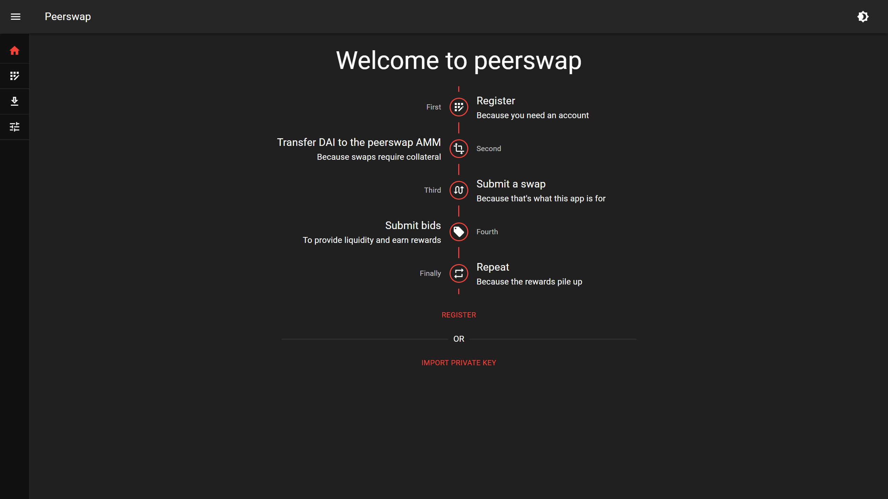

### Register Page

This page allows you to register an account with peerswap, letting you know which aliases have already been registered.

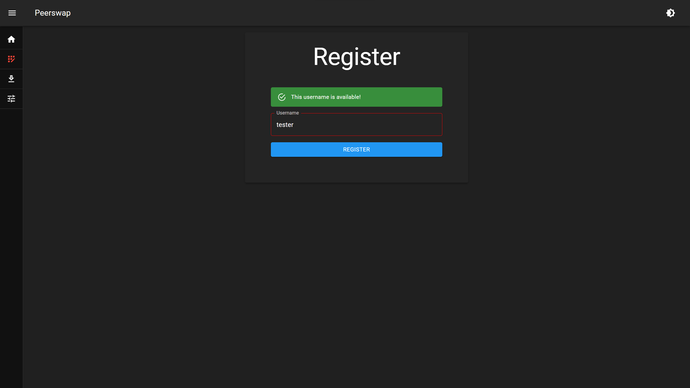

### Import Page

This page allows you to import an existing account using the private key from that account. If the key corresponds to an existing account that has registered an alias, then the user will immediately be logged in and redirected the the dashboard. `(There's currently no way to export your private key from peerswap other than looking in localStorage and copying it from there.)`

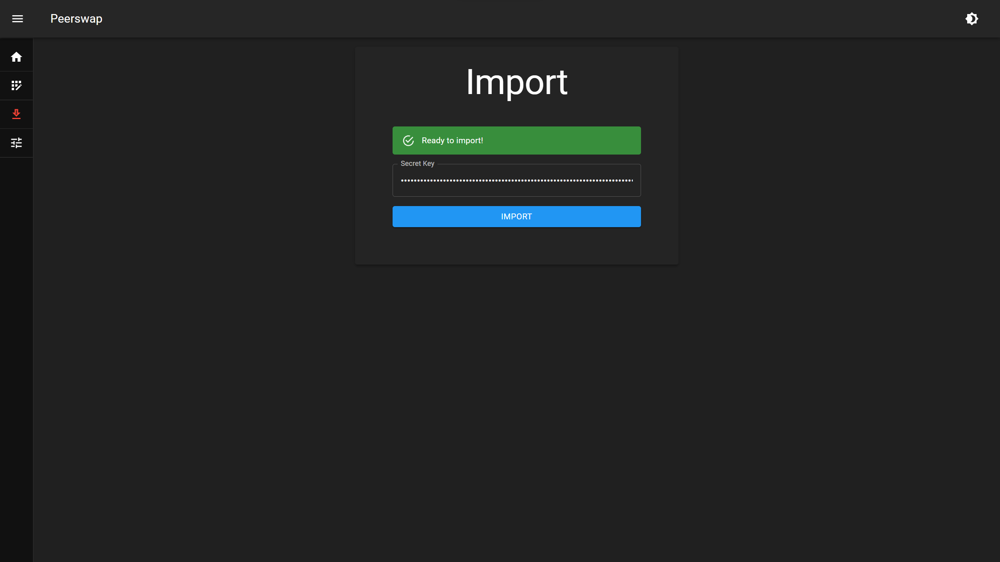

### Home Page or Dashboard

This page allows the user to view all the swaps and bids they have made, as well as realtime updates for any bids on their swaps, or updates to the status of either a bid or a swap. Thew user can also filter their swaps for a specified status, swap type, or tokens included in the offers and requests. Each card under the "YOUR SWAPS" divider represents one of the swaps you have made. The double checkmark icon in the section under each card is for confirmation that you received the asset requested in the swap. The Exclamation mark icon is to open a dispute. The carat icon is to open the list of bids other users have made on that swap. Underneath each bid, there is a checkmark icon that you can click to accept that bid. Each card under the "YOUR BIDS" divider represents one of the bids you have made. The double checkmark icon in the section under each bid card is for confirmation that you received the asset requested by your bid. The triple dot icon on the top right of each card currently doesn't do anything, but will most likely be additional actions that the user can perform in the future regarding the swap.

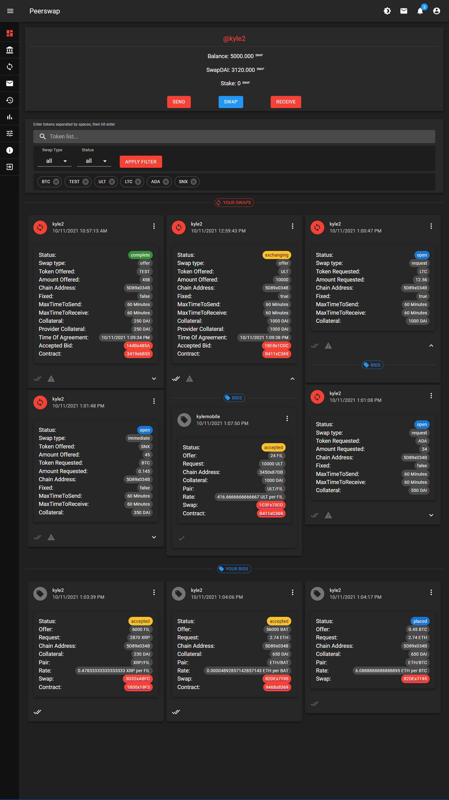

### Swaps Page

This page allows users to find swaps that interest them, in a very powerful "spreadsheet-like" environment. You can layer filter on top of filter in order to narrow down the swaps they're looking for, then additionally sort the results by any column. You can find the individual Swap page by clicking on the tag icon in the action column of each row.

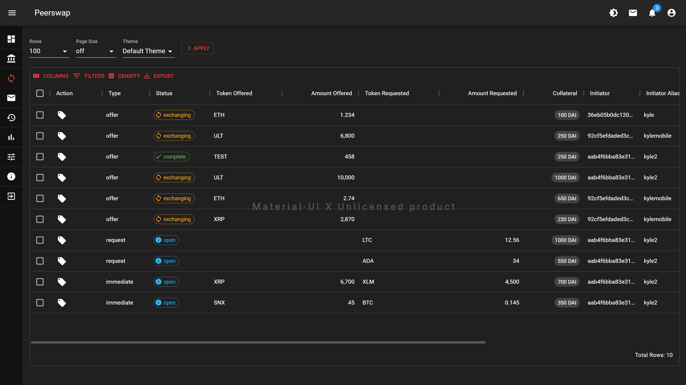

### Swap Page

This page displays the details of an individual swap request. It allows users to place bids and see the bids or offers that were made by other users. (Currently only allows you to place bids, will be updating to allow viewing of other bids very soon ;) ). When a bid is accepted, you can find the individual Bid page by clicking the red chip to the right of the label "Accepted Bid", and the individual Contract page by clicking the red chip to the right of "Contract Id".

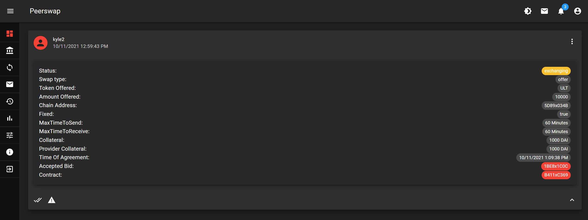

### Bid Page

This page displays the details of an individual bid request that was made on a swap. You can find the individual Swap page by clicking the red chip to the right of the label "Swap ID", and the individual Contract page by clicking the red chip to the right of "Contract Id".

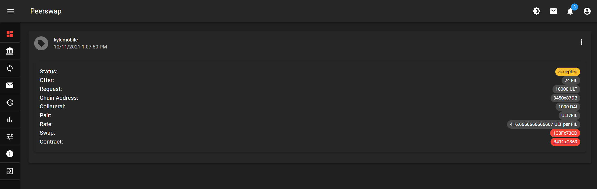

### Contract Page

This page displays the details of the contract that was made when the creator of the corresponding swap accepted a bid. You can find the individual Swap page by clicking the red chip to the right of the label "Swap Id", and the individual Bid page by clicking the red chip to the right of "Bid Id".

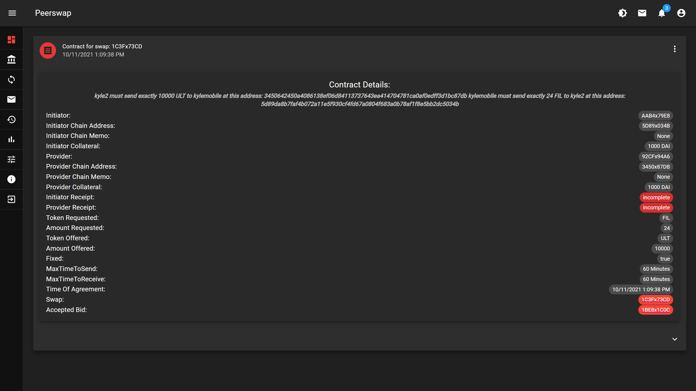

### Wallet Page

This page allows users to view their account balance in SWAP Tokens and DAI, send SWAP tokens to other users in the network, submit swap requests, and view QR codes for sharing their address or alias to receive tokens.

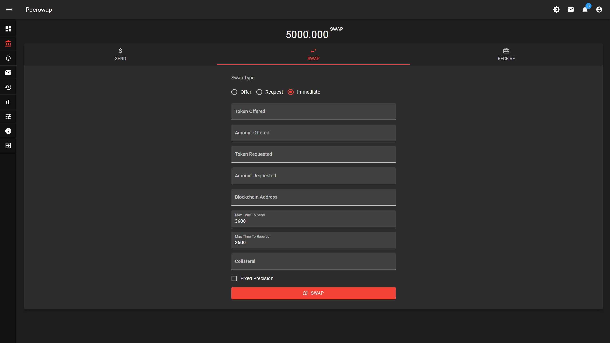

### Economoy Page

This page allows users to view the current network paramters used by peerswap, and provides a form to submit a proposal to change those parameters. You can click on the VOTE button to view and vote for the active proposals submitted by other users.

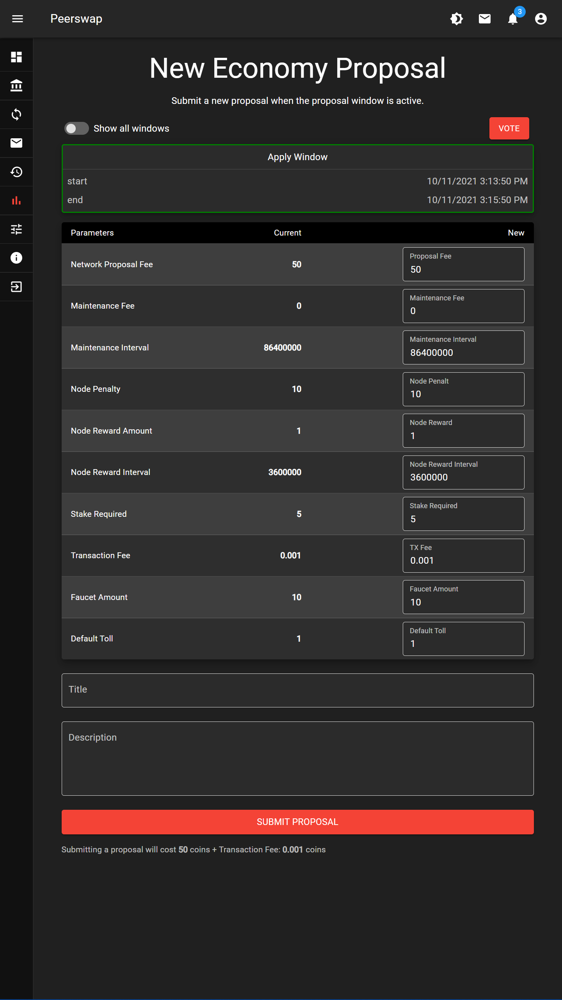

### Messages Page

This page allows users to send messages to other users about anything that they feel is necessary. `(Design is very janky currently so I didn't bother to add an image of this page.)`

### Transactions Page

This page shows users their entire history of transactions that they have made to the network.

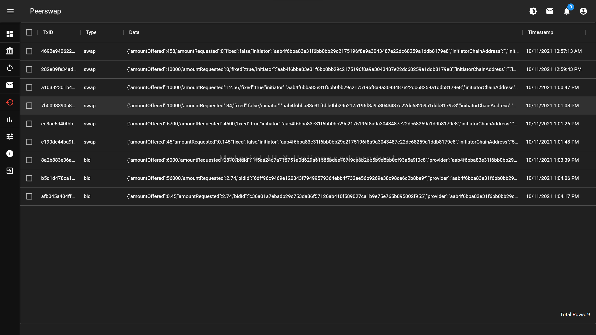

### Settings Page

This page allows users to change the current IP address and PORT of the archive server they wish to connect to for getting host nodes for API calls and transactions.

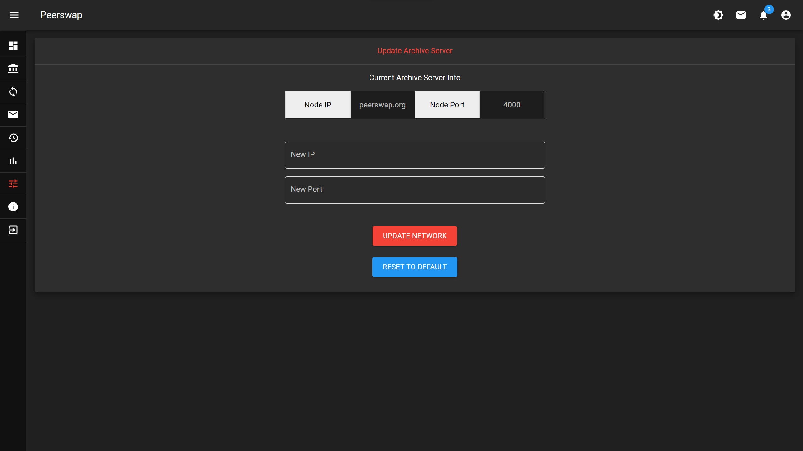
