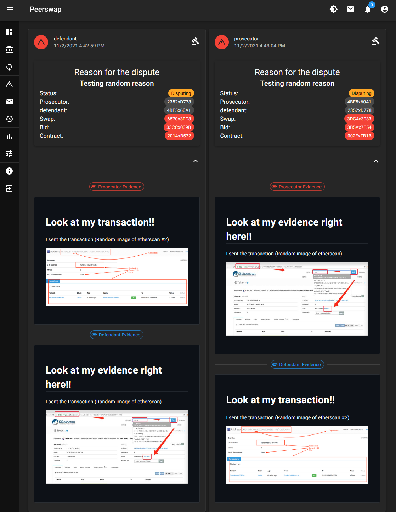

# Dispute system UI design

This document is meant to provide a guide for developing the dispute process UI.

## Todo List

1. Add the ability to submit disputes on bids in the dashboard
2. Add a modal for entering the reason for starting the dispute.
3. Add the ability for users to join the jury for a dispute case.
4. Add the ability for jurors to vote `guilty` or `innocent` for the defendant
5. Add Avatar Group of jurors and other UI elements to dispute card.
6. Add a page for individual users to view stats about that user.

### Disputes Page

The disputes page can be viewed by all users, and includes the currently active disputes in the network.

The page looks like this:

The things I need to add to this page:

Actions for users that aren't involved in dispute: `Join Jury` and `vote`.

Actions for users that are involved in the dispute: `submit-evidence`

UI elements that will look cool:

* Avatar groups of the users in the jury, or users who's votes are in.
* Actions for voting `guilty` or `innocent`

### Dispute Page

The dispute page can be viewed by all users and is meant to provide all the data regarding the dispute including the verdict when reached.

### Dispute Jury Page

The dispute Jury Page is mean to be used by the jurors to (potentially) discuss the evidence submitted by the users involved. You can see a list of who's votes are in, but it's hidden until the verdict is reached. This page might not be necessary.

